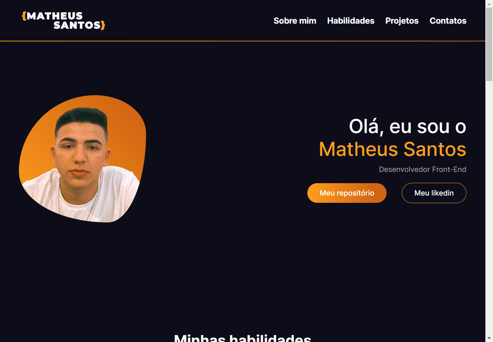

<h1 align="center"> Meu portifólio </h1>

  <a href="#-tecnologias">Tecnologias</a>&nbsp;&nbsp;&nbsp;|&nbsp;&nbsp;&nbsp;
  <a href="#-projeto">Projeto</a>&nbsp;&nbsp;&nbsp;|&nbsp;&nbsp;&nbsp;
  <a href="#memo-licença">Licença</a>

  

 

  

## 🚀 Tecnologias

Esse projeto foi desenvolvido com as seguintes tecnologias:

- HTML
- CSS
- Saas
- JavaScript
- Git 
- Github

## 💻 Projeto

Meu portifólio, desenvolvimento por mim mesmo, projeto que tenho um imenso carinho pois foi feito para mim.
Aprendi inúmeras coisas novas, tais como: estrutura de dados na prática com JavaScript, reaproveitamento de elementos,
boas práticas de codificação.

- [Acesse o projeto finalizado, online](https://matheus-meu-portifolio.vercel.app/)

## :memo: Licença

Esse projeto está sob a licença MIT.